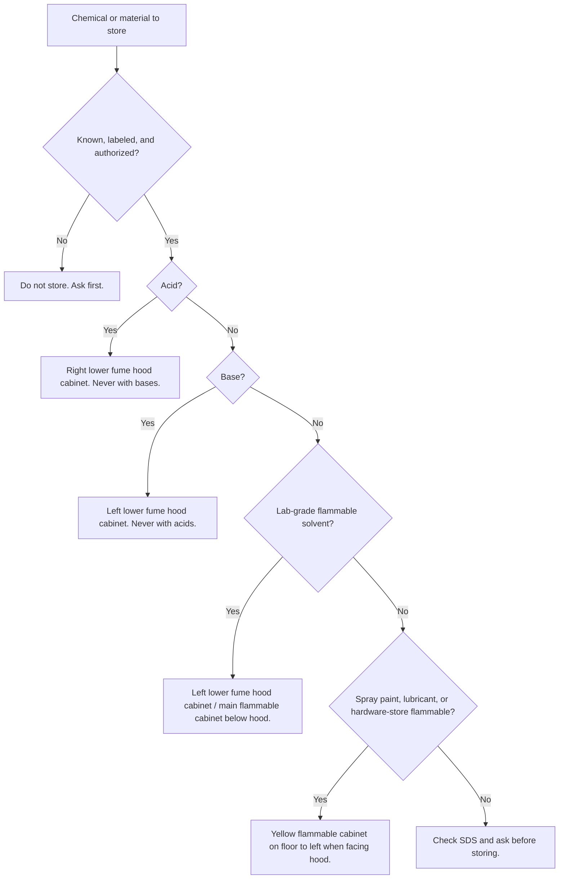

# Chemical and Materials Storage

Status: draft
DRAFT - NOT APPROVED FOR POSTING
Review owner: PI / post-doc
Last updated: 2026-07-01

Scope: Local storage reminders for chemicals, flammables, and shared materials in the FAST lab.

## Do Not Guess

- Store chemicals only if you are trained and authorized to handle them.
- Read the label and SDS before storing a chemical. This sign is not a compatibility chart.
- Keep chemicals in compatible, labeled, closed containers.
- NEVER store bases in the acid cabinet.
- Do not store oxidizers, peroxide formers, water-reactives, toxics, compressed gases, or other special-hazard materials by guessing from this table.
- If you are unsure where something belongs, do not put it away: ask the PI or a post-doc.

## Common Local Storage Locations After Compatibility Check

These are common local storage locations after a compatibility check.

| Item / category | Location | Notes |
| --- | --- | --- |
| Acids | Right lower cabinet of the fume hood | Never store bases here. Confirm compatibility before storage. |
| Bases | Left lower fume hood cabinet | This cabinet is also labeled flammable. Keep bases separated from acids and use secondary containment/segregation as required. |
| Lab-grade flammable solvents | Left lower fume hood cabinet / main flammable cabinet below the hood | Keep closed, labeled, and in approved containers. |
| Spray paints, lubricants, and hardware-store flammables | Yellow flammable cabinet on the floor to the left when facing the hood | Keep separate from lab-grade solvent storage. |
| Oxidizer, peroxide former, water-reactive, toxic, compressed gas, or special-hazard material | Do not guess from this sign | Check SDS and ask. |
| Unknown, unlabeled, leaking, damaged, expired, or off-inventory chemical | Do not store | Stop and ask. |

## Chemical Inventory

- FAST uses a chemical inventory spreadsheet to track chemicals and storage locations.
- Anyone trained and approved by the PI or a post-doc may add a chemical to storage.
- The person adding a chemical must make sure it is labeled, compatible with its storage location, and added to the inventory.
- Future workflow note: add a QR code to the chemical inventory spreadsheet when QR support is built.

## Related

- See [Fume Hood](fumehood.md) before working with volatile chemicals.
- See [Waste Disposal](waste-disposal.md) before discarding chemicals or contaminated materials.

## Sources / Procedure Links

- Western Laboratory Health and Safety Manual: <https://www.uwo.ca/hr/form_doc/health_safety/doc/manuals/lab_safety_manual.pdf>
- Western hazardous waste: <https://www.uwo.ca/hr/safety/topics/hazardous_waste.html>

## Reference Checks Needed

- SDS and compatibility guidance for chemical categories stored in the lab.
- Confirm where oxidizers, peroxide formers, water-reactives, toxics, compressed gases, and other special hazards should be stored in the current FAST lab setup.
