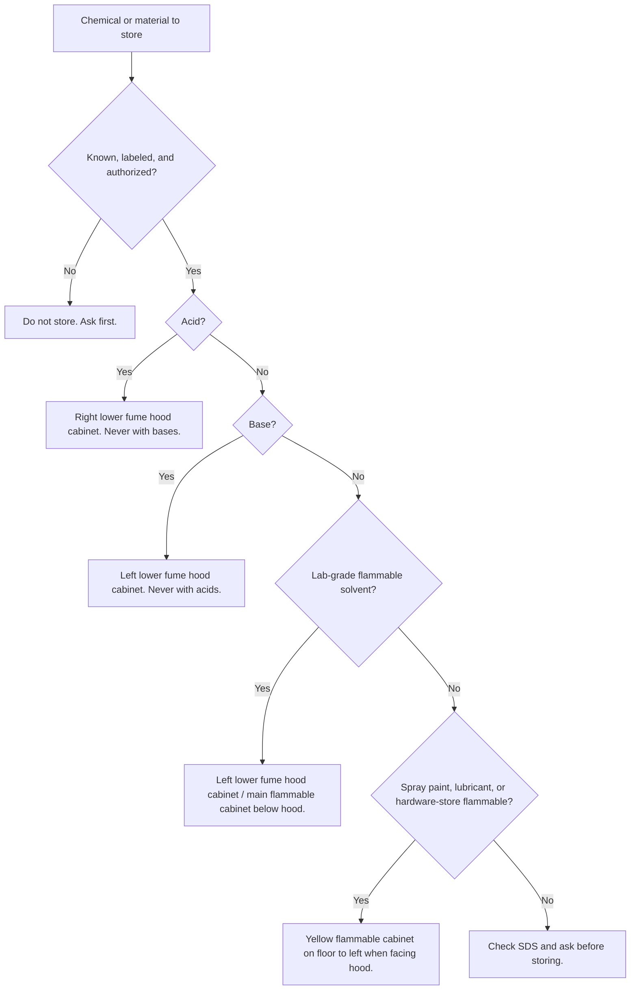

# Chemical and Materials Storage

## Do Not Guess

- Store chemicals only if you are trained and authorized to handle them.
- Read the label and SDS before storing a chemical. This sign is not a compatibility chart.
- Keep chemicals in compatible, labeled, closed containers.
- NEVER store bases in the acid cabinet.
- Do not store oxidizers, peroxide formers, water-reactives, toxics, or compressed gases by guessing from this table.
- If you are unsure where something belongs, do not put it away: ask the PI or a post-doc.
- Inorganic salts and ordinary organic liquids and solids may be stored together. The groups below are the exceptions.

## Common Local Storage Locations After Compatibility Check

| Item / category | Location | Notes |
| --- | --- | --- |
| Acids | Right lower cabinet of the fume hood | Never store bases here. Confirm compatibility before storage. |
| Bases | Left lower fume hood cabinet | Also labeled flammable. Keep bases away from acids; use secondary containment as required. |
| Lab-grade flammable solvents | Left lower fume hood cabinet / main flammable cabinet below hood | Keep closed, labeled, and in approved containers. |
| Spray paints, lubricants, hardware-store flammables | Yellow floor cabinet, left when facing the hood | Keep separate from lab-grade solvents. |
| Peroxide former | Flammable cabinet | Date when opened. Dispose at the SDS limit: 3 months for some ethers, 12 for most others. |
| Water-reactive | Per SDS, away from water and steam | Examples: sodium and potassium metal, phosphorus pentoxide, aluminum chloride. |
| Air-reactive (pyrophoric) | Under an appropriate gas, per SDS | Examples: alkyl lithiums, Grignard reagents, white phosphorus. |
| Oxidizer, toxic, compressed gas, or other special-hazard material | Do not guess from this sign | Check SDS and ask. |
| Possibly shock sensitive or explosive | Do not move it | Contact Occupational Health and Safety, extension 84847. |
| Unknown, unlabeled, leaking, damaged, or expired | Do not store | Stop and ask. |

## Chemical Inventory

- FAST uses a chemical inventory spreadsheet to track chemicals and storage locations.
- Anyone trained and approved by the PI or a post-doc may add a chemical to storage.
- Whoever adds a chemical must ensure it is labeled, compatible with its location, and recorded in the inventory.

## Related

- See [Fume Hood](fumehood.md) before working with volatile chemicals.
- See [Waste Disposal](waste-disposal.md) before discarding chemicals or contaminated materials.

## Sources / Procedure Links

- Lab Safety Manual: <https://www.uwo.ca/hr/form_doc/health_safety/doc/manuals/lab_safety_manual.pdf>
- Hazardous waste: <https://www.uwo.ca/hr/safety/topics/hazardous_waste.html>
