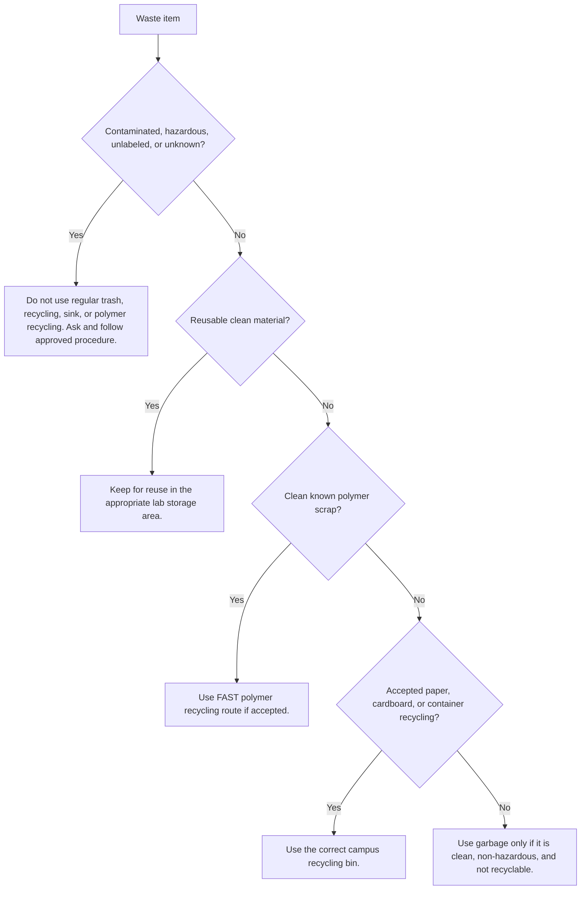

# Waste Disposal

Status: draft
DRAFT - NOT APPROVED FOR POSTING
Review owner: FAST lab manager
Last updated: 2026-07-01

Scope: Routine FAST lab waste sorting. Hazardous, chemical, biological, resin, and unknown waste must follow approved procedures.

## Before You Throw It Out

- Reduce waste when you can: plan jobs, prints, cuts, and purchases carefully.
- Reuse clean, simple materials when they are likely to be useful again.
- Recycle only clean materials that belong in an approved recycling stream.
- Discard only when reuse and recycling are not appropriate.
- If it is contaminated, hazardous, unlabeled, or unknown, stop and ask.

## Common Waste Streams

| Item | Preferred action | Notes |
| --- | --- | --- |
| Clean plates, blanks, blocks, containers, or simple offcuts | Reuse | Keep only if someone can realistically use it again. |
| Clean known PLA, PETG, ABS, or similar print waste | FAST polymer recycling | Accepted materials and contamination limits need local confirmation. |
| Paper or cardboard | Paper/cardboard recycling | Small bins are by the TEB6/TEB7 doors; large blue bins are in hallways or the loading dock area. |
| Clean accepted containers | Container recycling | Confirm the campus stream before using it. |
| Food-contaminated or dirty non-hazardous waste | Garbage | Do not contaminate recycling streams. |
| Chemical, resin, oil, grease, solvent, acid, base, biological, or unknown waste | Ask / approved waste procedure | Do not pour down the sink or place in regular trash/recycling. |

## Special Streams

| Item | Action |
| --- | --- |
| Unknown chemical or unlabeled liquid/solid | Do not discard. Identify or characterize through the approved Western hazardous-waste process. |
| Batteries or damaged battery packs | Do not use regular trash/recycling. Use the approved battery/e-waste process. |
| Electronics, circuit boards, cables, or e-waste | Use the approved e-waste process. |
| Broken glass or sharps | Use the approved glass/sharps container or ask. |
| Aerosols, spray paints, lubricants, oils, greases, or solvents | Use the approved hazardous-waste or special-waste process. |
| Empty chemical/resin bottles or contaminated containers | Do not recycle until the approved procedure says they are empty/clean enough. |

## Do Not Guess

- Do not neutralize, dilute, evaporate, rinse, or pour out chemical waste unless an approved procedure explicitly says to do so.
- Do not mix waste streams to "make it easier" to discard.
- Do not put contaminated material in paper, container, or polymer recycling.
- Western hazardous waste guidance says unknowns must be identified or characterized before acceptance.
- When in doubt, ask the lab manager, responsible equipment owner, post-doc, or Dr. Pearce.

## Sources / Procedure Links

- Western hazardous waste: <https://www.uwo.ca/hr/safety/topics/hazardous_waste.html>
- Western Laboratory Health and Safety Manual: <https://www.uwo.ca/hr/form_doc/health_safety/doc/manuals/lab_safety_manual.pdf>

## Reference Checks Needed

- Western/UWO drain-disposal rules.
- Western/UWO or campus recycling guidance.
- Western/UWO battery, e-waste, sharps, and broken-glass guidance.
- FAST accepted polymer recycling materials and contamination limits.
- Local process for oils, greases, lubricants, resins, solvents, acids, and bases.
