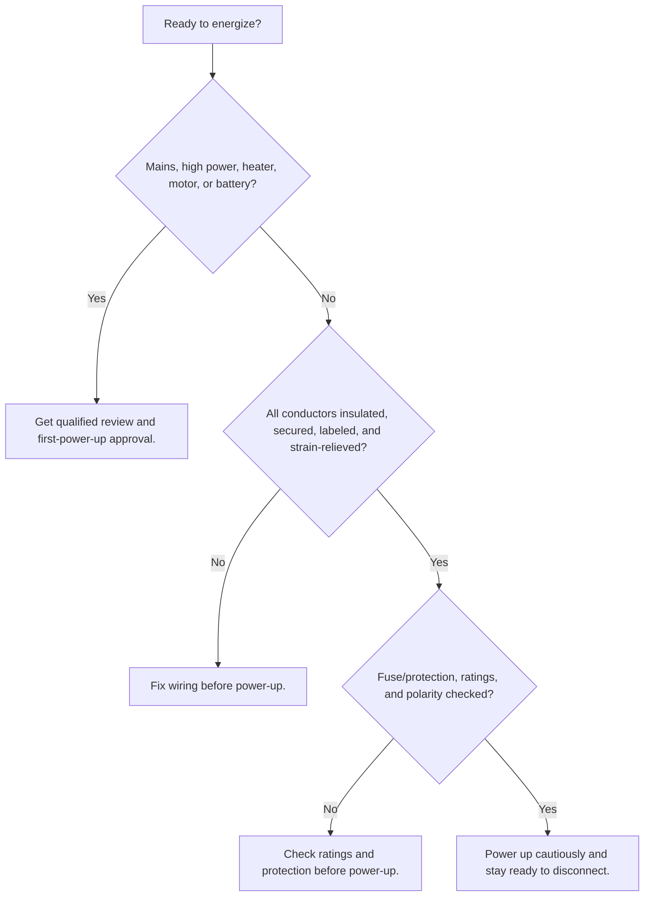

# Wiring

Status: draft
DRAFT - NOT APPROVED FOR POSTING
Review owner: Cameron B. / Dr. Pearce / qualified electrical reviewer
Last updated: 2026-07-01

Scope: Wiring and enclosure reminders for FAST lab prototypes and equipment. High-power, mains, or building-connected electrical work requires qualified review.

## Stop Before Wiring

- Do not wire mains, high-power, heaters, motors, batteries, or permanent equipment unless you are trained and authorized.
- Do not modify building wiring, outlets, breakers, power bars, extension cords, or certified equipment.
- Use certified or appropriately rated components for the voltage, current, temperature, environment, and enclosure.
- If a design depends on current rating, fuse sizing, wire gauge, grounding, insulation, or code compliance, get review before building.
- Treat mains voltage, large batteries, heaters, motors, high-current supplies, wet locations, unattended operation, or anything connected to building services as review-required.
- Custom mains wiring that touches building mains must be reviewed and approved by a qualified electrical reviewer before first power-up.
- If you are unsure, stop and ask before energizing anything.

## Plan The Enclosure

- Start with a simple enclosure that is larger than you think you need.
- Leave room for wiring, labels, strain relief, service loops, airflow, and future inspection.
- Use standoffs, spacers, DIN rail, mounting plates, or other secure supports.
- Keep wiring away from sharp edges, moving parts, hot surfaces, fans, belts, and pinch points.
- Separate low-voltage control wiring from higher-power wiring when appropriate.
- Label connectors, switches, power inputs, outputs, fuses, and unusual hazards.

## Build Cleanly

- Use proper connectors, terminals, ferrules, crimps, insulation, strain relief, and cable management.
- Use an approved cord, switched outlet or disconnect, in-line fuse or circuit breaker, proper grounding, appropriate wire gauge, rated enclosure, strain relief, and clear labels for purpose and voltage.
- Do not leave exposed conductors.
- Do not rely on tape, hot glue, loose knots, or friction as permanent insulation or strain relief.
- Do not daisy-chain power bars or extension cords.
- Do not use extension cords as permanent wiring.
- Keep access to outlets, disconnects, panels, breakers, and emergency shutoffs clear.
- Use GFCI or other required protection where the approved procedure requires it, especially near wet areas or conductive workspaces.

## Before Power-Up

- Inspect for exposed conductors, wrong polarity, loose terminals, damaged insulation, and missing strain relief.
- Check that fuses, breakers, connectors, wires, and supplies are rated for the expected load.
- Ask Cameron B. or Dr. Pearce to direct you to the appropriate electrical reviewer before first power-up of review-required wiring.
- Stay with the equipment during first power-up and be ready to disconnect power.

## Quick Checks

For DC loads:

$$
P = IV
$$

Check voltage, current, power, connector rating, wire rating, fuse/protection, startup current, duty cycle, enclosure heat, and fault conditions together. Do not size wiring from one number alone.

For resistive loads:

$$
V = IR
$$

For a first-pass voltage-drop check:

$$
\Delta V = IR
$$

## Reference Checks Needed

- Western electrical safety guidance: <https://www.uwo.ca/hr/safety/topics/electrical.html>
- Western electrical installations and approvals advisory: <https://www.uwo.ca/hr/form_doc/health_safety/doc/hazard_alerts/electrical_safety_advisory.pdf>
- Western Laboratory Health and Safety Manual electrical equipment guidance: <https://www.uwo.ca/hr/form_doc/health_safety/doc/manuals/lab_safety_manual.pdf>
- Ask Cameron B. or Dr. Pearce for examples of approved wiring/enclosures.
- Applicable equipment manuals, component datasheets, certification requirements, and local code/ESA requirements.
